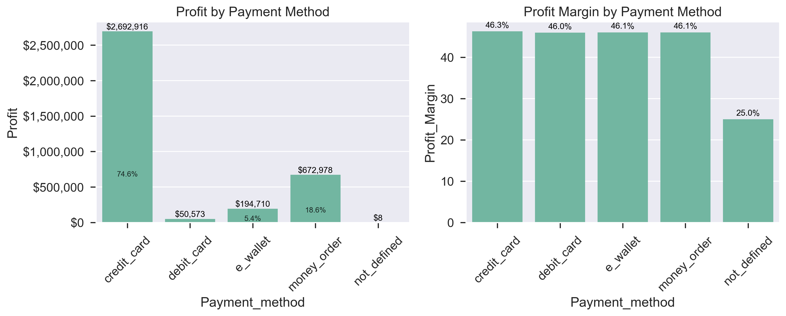

# E-commerce Profit Analysis: Where is the Most Profit to be Found?

## Introduction
This analysis addresses a critical business question: "Where is the most profit to be found?" in our e-commerce operations. By identifying profit hotspots across multiple dimensions of the business, this report provides data-driven insights to guide strategic decision-making, resource allocation, and growth planning.

## Data Source
The analysis uses data from the Kaggle E-commerce dataset, which contains 51,290 transaction records with information on:
- Product categories and specific products
- Customer demographics (gender)
- Device types and login methods
- Order details (dates, payment methods, priorities)
- Financial metrics (sales, profit, discount)

The dataset is comprehensive with minimal missing values (less than 0.01%) across 16 columns, providing a solid foundation for analysis. The total sales volume captured is $7,813,411 with overall profit of $3,611,186 and an average profit margin of 42.53%.

## Methodology
The analysis followed a structured approach:
1. **Data Cleaning**: Handling missing values, standardising data types, and ensuring data quality.
2. **Multi-dimensional Analysis**: Examining profit from various angles including products, categories, customer segments, and pricing.
3. **Comparative Assessment**: Analysing profit metrics (total profit, margins, profit per item) across dimensions.
4. **Visual Exploration**: Creating clear visualisations to identify patterns and relationships.

Python with pandas was used for data processing, while Matplotlib and Seaborn provided visualisation capabilities.

## Key Findings

### 1. Product Category Analysis

Fashion is the dominant profit center, generating $2,072,624 in profit (57.4% of total profit) with the highest profit margin at 47.7%. The remaining categories follow in descending order:
- Home & Furniture: $880,059 (24.4% of profit, 44.5% margin)
- Auto & Accessories: $484,313 (13.4% of profit, 44.2% margin)
- Electronic: $174,191 (4.8% of profit, 44.1% margin)

### 2. Product-Level Analysis

The profit concentration is even more pronounced at the product level, with striking results:
- The top 5 products (all from Fashion) account for over 40% of total profit.
- T-Shirts alone generate $340,721 (9.4% of total profit) with an exceptional 58.9% margin.
- The top 10 products include 7 Fashion items and 3 Home & Furniture items.

### 3. Customer Segment Analysis

The Customer Segment Analysis section provides insights into how profits are distributed between male and female customers, as well as the product categories contributing to their respective profits.

Gender analysis reveals:
- Male customers generate $1,990,782 (55.1% of profit).
- Female customers generate $1,620,405 (44.9% of profit).

- **Male customers** with the majority of their profit coming from the **Fashion** and **Auto & Accessories** categories.
- **Female customers** with strong contributions from the **Home & Furniture** and **Fashion** categories.

### 4. Device Type Analysis

The device analysis shows an overwhelming dominance of web-based shopping:
- Web: $3,348,897 (92.7% of profit).
- Mobile: $262,290 (7.3% of profit).

### 5. Payment Method Analysis

Credit cards dominate payment methods:
- Credit Card: $2,692,916 (74.6% of profit).
- Money Order: $672,978 (18.6% of profit).
- E-Wallet: $194,710 (5.4% of profit).
- Debit Card: $50,573 (1.4% of profit).

### 6. Discount Strategy Insights

The discount analysis reveals an important relationship between discount levels and profitability:
- 0-10% discounts: Highest profit margin (50.0%) but lowest total profit ($556,010).
- 11-20% discounts: Best balance of margin (47.3%) and total profit ($836,559).
- Higher discounts show progressively lower margins.

### 7. Seasonal Patterns

Clear seasonal patterns emerge:
- Peak profit months: November ($406,809), May ($379,386), July ($374,392).
- Lowest profit months: February ($153,288), January ($174,574).
- Despite volume fluctuations, profit margins remain stable around 46%.

## Recommendations

### 1. Product Strategy
- **Fashion Focus**: Allocate the majority of inventory and marketing resources to Fashion, particularly the top 5 products that contribute over 40% of total profit.
- **T-Shirt Excellence**: Develop an expanded T-shirt line with variations in design, materials, and price points.
- **Product Mix Optimisation**: Review the low-performing Electronic category (4.8% of profit) to either improve performance or reduce resource allocation.

### 2. Customer Targeting
- **Gender-Specific Marketing**: Create targeted campaigns for male customers in Fashion and Auto categories, and female customers in Home & Furniture.
- **Mobile Channel Growth**: Implement a mobile-first strategy to grow the underutilized mobile channel (7.3% of profit) through app improvements and mobile-exclusive offers.

### 3. Pricing Strategy
- **Strategic Discounting**: Implement a tiered discount strategy:
  - Premium Strategy (0-10% discounts): For high-margin products and loyal customers.
  - Volume Strategy (11-20% discounts): For customer acquisition and maximising total profit.
  - Limited Deep Discounts (>20%): Reserved for inventory clearance and special promotions.

### 4. Seasonal Planning
- **Peak Season Preparation**: Develop comprehensive strategies for the November, May, and July profit peaks.
- **Off-Season Stimulus**: Create special promotions to boost sales in the lowest-performing months (January-February).

### 5. Payment Optimisation
- **Credit Card Priority**: Enhance the credit card payment experience and develop card-specific loyalty programs.
- **E-Wallet Expansion**: Invest in expanding e-wallet adoption, which shows strong margins (46.1%).

## Conclusion
Our analysis clearly shows that the most profit is found at the intersection of several key dimensions:
1. **Category & Product**: Fashion dominates with 57.4% of profit, with just five products (T-Shirts, Titan Watch, Running Shoes, Jeans, and Formal Shoes) contributing over 40% of total profit.
2. **Customer Segment**: Male customers generate more profit (55.1%), with a particularly strong preference for Fashion products.
3. **Pricing Strategy**: The sweet spot for discounting appears to be the 11-20% range, which delivers the highest total profit while maintaining a strong 47.3% profit margin.
4. **Channel**: Web-based shopping accounts for 92.7% of profit, highlighting both a strength to maintain and an opportunity to grow mobile.
5. **Seasonality**: November, May, and July represent profit peaks that should be maximized through strategic planning.

By focusing resources on these profit hotspots while developing targeted strategies to address underdeveloped areas, we can maximize profitability and drive sustainable business growth.